🚩Team: [ICEDTEA](https://ic3dt3a.org/)  
🚩CTF challenge link: https://2024.imaginaryctf.org/Challenges.html  
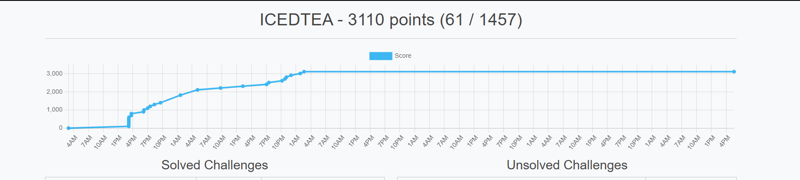  
隊上完整的版本: https://ic3dt3a.org/posts/2024ictf/
## 🌐 Web

### readme
> https://cybersharing.net/s/67af3fd941707117

按下 Load Preview  


接著打開開發者工具，找到對應的請求  


把要求網址的後面的 ```readme.tar.gz``` 改成 ```flag.txt``` 即可拿到檔案  
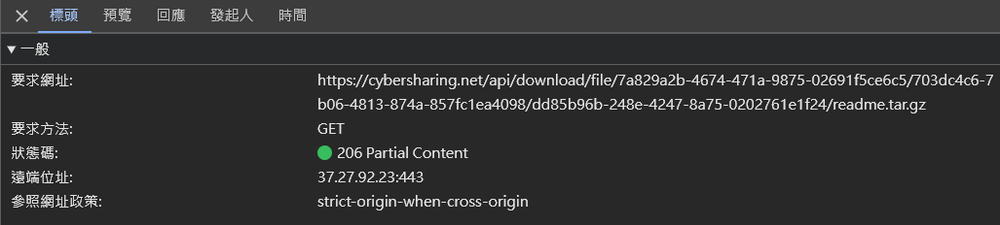  
```
https://cybersharing.net/api/download/file/7a829a2b-4674-471a-9875-02691f5ce6c5/703dc4c6-7b06-4813-874a-857fc1ea4098/7aeb7c98-9bf5-44b3-9eb3-972f225a3576/flag.txt
```

但打開會發現這實際上不是 .txt 檔，所以先丟進 Linux 裡面查看檔案類型  
```bash=
wget https://cybersharing.net/api/download/file/7a829a2b-4674-471a-9875-02691f5ce6c5/703dc4c6-7b06-4813-874a-857fc1ea4098/7aeb7c98-9bf5-44b3-9eb3-972f225a3576/flag.txt
file flag.txt
```

發現是 gzip 檔，解壓縮它並繼續查看檔案類型  
```bash=
mv flag.txt flag.gz
gzip -d flag.gz
file flag
```

發現是 tar 檔，解壓縮它  
```bash
tar -xvf flag
```

在解壓縮出來的檔案中有一個名為 ```flag``` 的檔案，查看它的內容  
```bash
cat flag | grep ictf
```

報錯了，終端回應 ```grep: (standard input): binary file matches```，於是加上 ```-a``` 選項，這會強制 ```grep``` 處理二進制文件為文本  
```bash
cat flag | grep -a ictf
```

flag：```ictf{path_normalization_to_the_rescue}```


## 🔍 Forensics


### cartesian-1
上 Instagram 搜尋 Terrence Descartes
> https://www.instagram.com/descartes.terry2001/
 
在限時動態中發現 flag  


### cartesian-2
上 LinkedIn 搜尋 Terrence Descartes，會看到一個跟前面 Instagram 帳號同樣頭像的[帳戶](https://www.linkedin.com/feed/update/urn:li:activity:7220221551969759232/)，點下去後查看第一則貼文的第二張照片，裡面有寫 flag(2/1)  


利用[ epieos ](https://epieos.com/)搜尋 terrencedescartes@gmail.com（用姓名猜出來的）

Google Calendar 右邊的[連結](https://calendar.google.com/calendar/u/0/embed?src=terrencedescartes@gmail.com)點進去

題目說要觀察他去年夏天旅行，所以前往 2023 年 6 月，會看到 SUMMER TRIP!!!，點下去就能看到 flag(2/2) 了  


### cartesian-3
> http://cartesian.chal.imaginaryctf.org/

1. What is your email?  
A: terrencedescartes@gmail.com  
用姓名去猜即可

2. On what day were you born? (YYYY-MM-DD)  
A: 2001-01-18  
此篇[ Instagram 貼文](https://www.instagram.com/p/C9lkBOjxQCW/)是他的半歲生日慶祝文，用發文日期減去 6 個月後即是他的生日，年份的部分則在名稱中就透露了

3. What is the name of your favorite pet?  
A: bonnie  
這篇[ Instagram 貼文](https://www.instagram.com/p/C9llEYxxl5x/)寫的

4. What city have you primarily lived in for the past three months?  
A: San Diego  
這篇[ Instagram 貼文](https://www.instagram.com/p/C9lmMxHRRrU/?img_index=1)寫說剛從學校回到家，代表過去 3 個月應該都在學校附近生活，而 Instagram 自我介紹透露出學校是 UCSD，搜尋後發現在 San Diego  


5. In what city did you grow up?  
A: Phoenix  
根據他的公開資訊得知：

Home **↔️** NYC: 2139 英里（資訊來自 Google 日曆）  
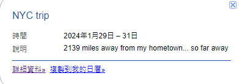

Home **↔️** 西雅圖: 1114 英里（資訊來自 Github）   
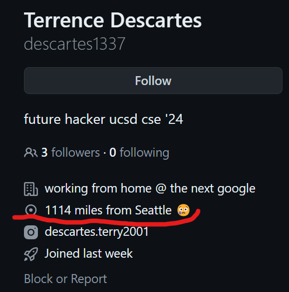

Home **↔️** UCSD: 300 英里（資訊來自 Instagram）  


- 以下三角定位的部分是由隊友[佑丞](https://www.instagram.com/youcheng0406/)完成的：

找不到適合的工具來三點定位，於是打開 Google 地球，玩了一下量測發現是單位是**公尺**，透過 ChatGPT 先把隊友提供的線索轉換成公尺。  
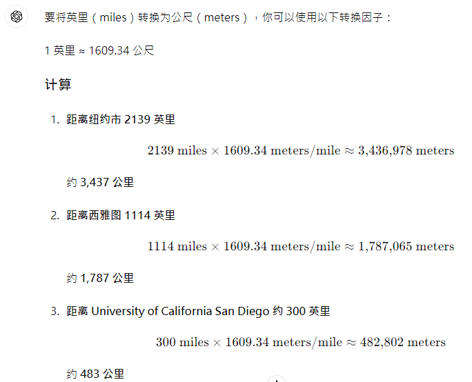

首先點紐約市拉一條約 3436000 公尺的線(大概就好不用太準只是用來找方向的)  
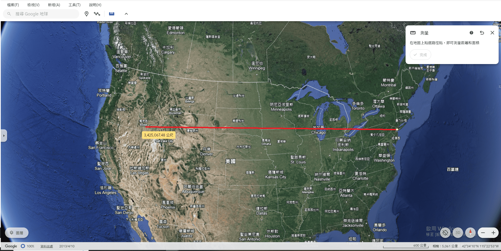

然後搜尋 UCSD，從 UCSD 拉一條大概接近 1787000 公尺多的線，區域應該是在亞利桑那州，而且鳳凰城很靠近量測點，所以猜測是鳳凰城。  
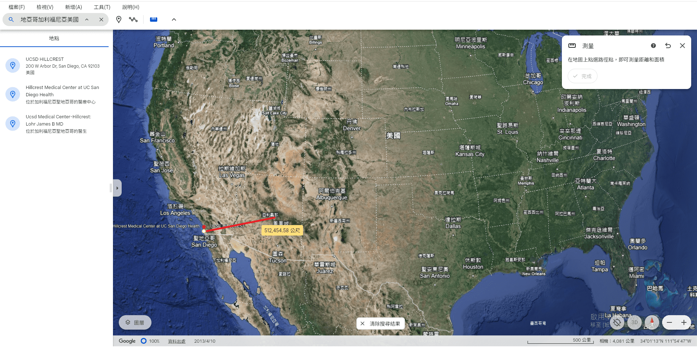

最後從西雅圖那個點拉一條 482000m 的線，確實在亞利桑那州範圍內，接著找出距離最接近 1,787,065m 位置的城市，看了一下鳳凰城，把量測點拉過去驗證，符合猜測。  
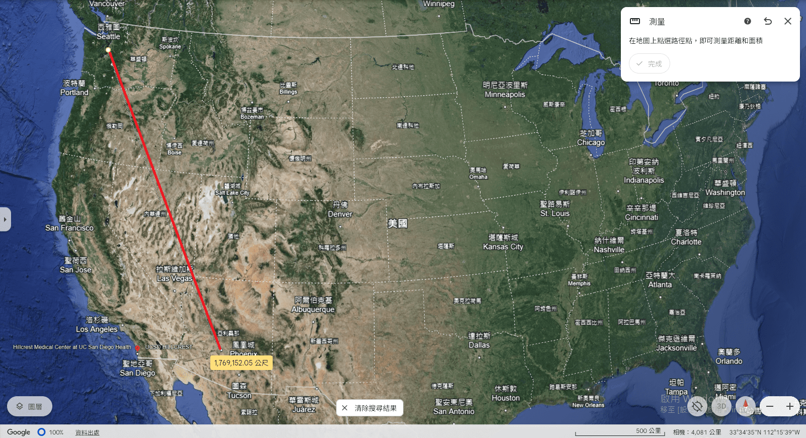

1. What is the name of your favorite poet?  
A: Robert Frost  
從他 Instagram 帳戶追蹤的對象看出來的，每個都跟 Robert Frost 有關  
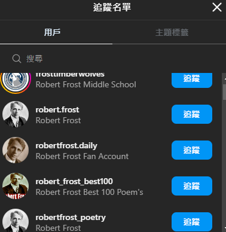

1. What was the make and model of your first car?  
A: Honda Civic  
這篇[ Instagram 貼文](https://www.instagram.com/p/C9lmMxHRRrU/?img_index=1)最後有寫 **#firstcar**，對圖片使用 Google 智慧鏡頭即可搜尋出車款  


1. In what year was your father born?  
A: 1981  
上 Github 搜尋 terrence descartes 只能找找到一個[帳戶](https://github.com/descartes1337)，查看他唯一的專案的 commits 裡的[ redact sensitive info ](https://github.com/descartes1337/birthday-card/commit/e6f565a35fd10136647336780731a4d19aabfac7)會發現他爸 43 歲，2024-43=1981  
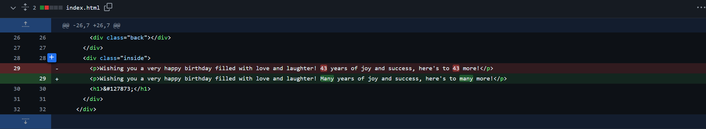

1. What is your mother's maiden name?  
A: Jackson  
  
從此篇[ LinkedIn 貼文](https://www.linkedin.com/feed/update/urn:li:activity:7219899411361882112/)中得知她媽媽姓名為 Amelia Jackson Descartes，根據美國冠夫姓的方式，會把夫姓放後面，引此婚前姓氏為 Jackson

1.  At what company do you work at?  
A: Cohort Calculations  
他的 LinkedIn 寫的：  


1.  In what city did you go on vacation last summer?  
A: Saint Paul  
  
搜尋[此貼文](https://www.linkedin.com/feed/update/urn:li:activity:7220221551969759232/)第二張圖片左上角的地點的所在地即可得知答案

1.  What are you supposed to do on August 21?  
A: Drop off top secret information  
在他的 Google 日曆中察看 8/21 的行程即可得知答案  

1.  Who was your boss in your first job?  
A: Farmer Johnson  
在他的 LinkedIn 中寫的第一份工作的公司名稱的一部分即是答案  
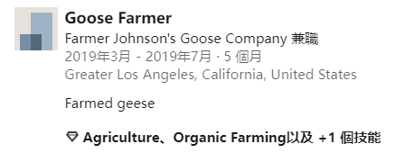

最後填完所有資料按下 **submit** 就會跳到 flag 頁面  


### dog-mom
> https://cybersharing.net/s/4f1dbcbb01b5f98d  


搜尋圖片其中一個地方後 Google 辨識出地點了  
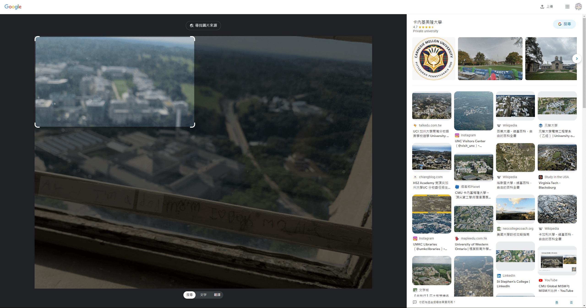

接著在 Google 地球上搜尋此地點後稍微逛一下附近即可找到題目圖片左下方的地點  


根據拍攝角度來看應該是在有一定高度的地方拍的，大概率是在學習大教堂上  


盡可能還原拍攝角度了 XD  


### playful-puppy
> https://cybersharing.net/s/1b3a43db9cb73c3d

題目給的是一個 minecraft 地圖檔，稍微翻一下後在 ```playful-puppy\world\datapacks\Dog data\data\test\function``` 裡發現了一個名為 ```dog.mcfunction``` 的檔案，打開來發現是一堆生成狗（在 minecraft 裡是狼）的指令，語法如下：  
```
summon minecraft:wolf ~ ~ ~ {CustomName:dog name,Owner:cleverbear57,CustomNameVisible:0,variant:black,CollarColor:15}
```  

接著把 ```playful-puppy\world``` 丟到你的minecraft資料夾的 ```saves``` 底下，在遊戲中打開它，會發現一堆狗  


所以猜測 ```dog.mcfunction``` 生成的都不是他的狗，把裡面的 ```summon``` 指令改成 ```kill``` 指令把多餘的狗殺掉後就會剩下他的狗了（這部分其實是由隊友 [ChiLin.H](https://neko70.net/) 猜到的）。

指令改成：    
```
kill @e[type=minecraft:wolf,name="dog name"]
```  
 
接著進到遊戲中按下 <kbd>T</kbd>，執行 ```/reload```，再執行 ```/function test:dog```，即可消滅多餘的狗，就可以找到他的狗了，接著把名稱填入 ictf{``` ```}內即可  
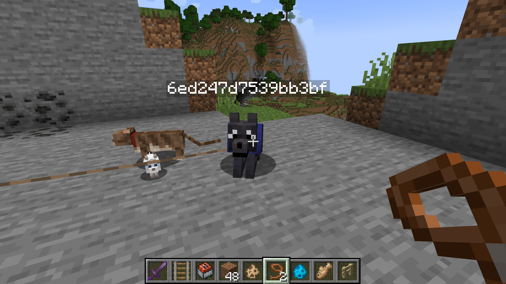

事後看[ 官方 writeup ](https://github.com/ImaginaryCTF/ImaginaryCTF-2024-Challenges-Public/tree/main/Forensics/playful-puppy)發現根本不是這樣解，是出題者忘了把 ```dog.mcfunction``` 刪掉了

正常來講應該是要從題目給的圖片中看出項圈是藍色的，再透過 Google 搜尋發現決定項圈顏色的標籤是 CollarColor，而藍色的 ID 是 11，再透過[NBTExplorer](https://www.minecraftforum.net/forums/mapping-and-modding-java-edition/minecraft-tools/1262665-nbtexplorer-nbt-editor-for-windows-and-mac)打開地圖檔，按下 <kbd>Ctrl</kbd>+<kbd>F</kbd>，Name 處填入 CollarColor，Value 處填入 11，按下 Find 後即可在 ```CollarColor: 11``` 底下看到 ```CustomName: "6ed247d7539bb3bf"```