  
[🚩 CTFtime](https://ctftime.org/event/2574/)  

## 🏁 Misc
### Blog 1
> https://neko-2077.github.io/

透過網址得知對應的 GitHub 使用者名稱，在 GitHub 上搜尋後找到這個 Blog 的 repositories  
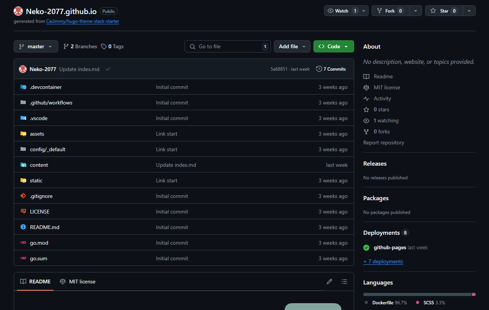
Commits 點進去，可以看到有一個名為不可以瑟瑟的 commit，點進去  
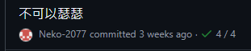

按下 Load Diff 後即可查看 Flag  
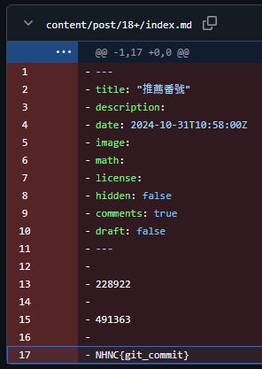

Flag:`NHNC{git_commit}`

### Blog 2
> https://neko-2077.github.io

[推薦 Vtuber](https://neko-2077.github.io/p/%E6%8E%A8%E8%96%A6-vtuber/) 這篇文章底下的評論區有個管理員（Neko-2077）的留言，點擊他的頭像以查看他的個人檔案  
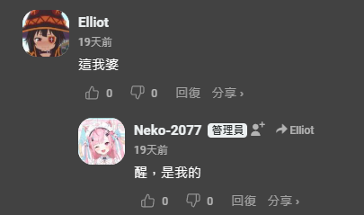

可以看到一個他在其他網站上的評論，點進去查看它  


然後就可以看到 Flag 了  
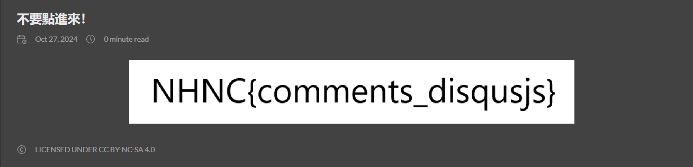
Flag:`NHNC{comments_disqusjs}`

### Blog 3
> https://neko-2077.github.io/

對推薦 Vtuber 的封面圖片點右鍵然後在新分頁開啟  
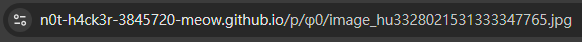

從域名可以看出這個圖片是來自其他網站的，把域名後面的內容移除即可看到 Blog 3  
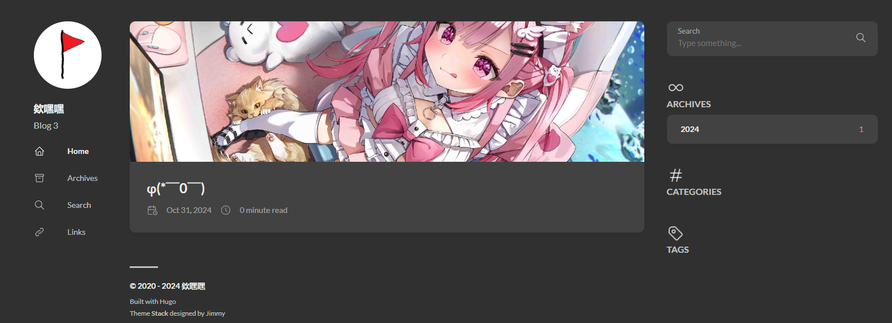


點進唯一的文章裡即可看到 Flag  
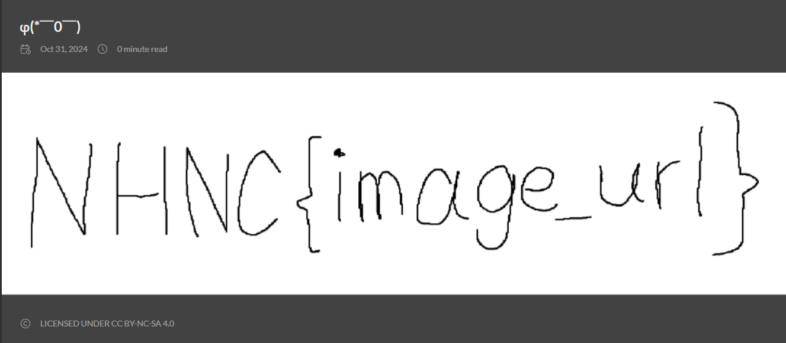

Flag:`NHNC{image_url}`

### Where is this
> 

將圖片放大可以看到後面有家店的名稱是「河堤上的貓」  
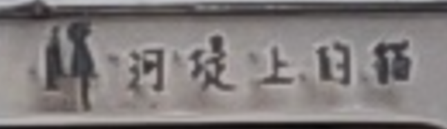

在 Google 地圖上搜尋後即可得知位置  
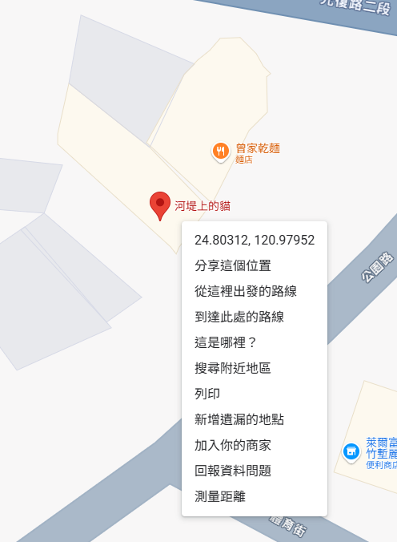

Flag:`NHNC{24.803_120.979}` or `NHNC{24.802_120.979}`  
（如果以拍攝者角度來看的話那就是後者，下次應該改用四捨五入的）
### Beep beep beep!
> [flag.wav](https://github.com/Elliot-32/Elliot-32.github.io/raw/refs/heads/main/src/content/posts/NHNC2024wp/flag.wav)

使用 `ffmpeg -i` 查看音檔資訊  
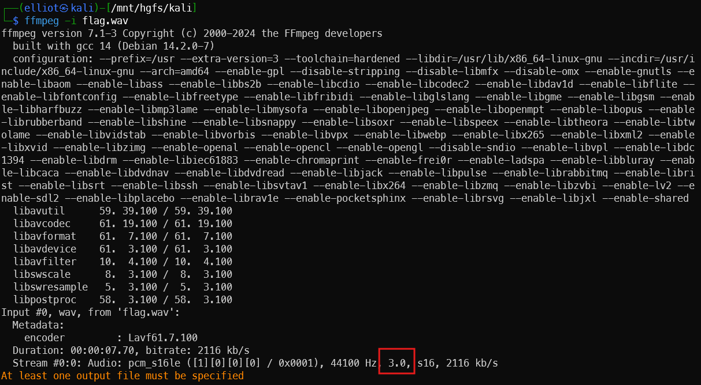  
發現是三聲道音訊

使用以下指令把這三個聲道拆分開來  
```bash
ffmpeg -i flag.wav -filter_complex "[0:a]channelsplit=channel_layout=3.0[FL][FR][FC]" \
-map "[FL]" left_channel.wav -map "[FR]" right_channel.wav -map "[FC]" center_channel.wav
```  
分別播放一次後發現 `center_channel.wav` 只有 DTMF 的聲音，使用 [DTMF Decoder](https://dtmf.netlify.app/) 解碼它  
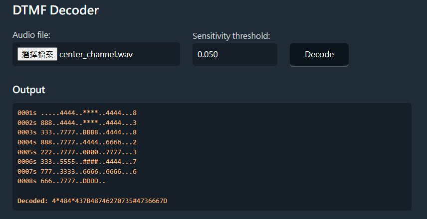

把 `*` 替換為 `E`，`#` 替換為 `F`，當成 16 進制，再轉換成字串即可得到 Flag  
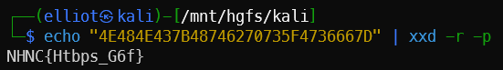  
Flag: `NHNC{Htbps_G6f}`

## 🔍 Forensics

### Kohiro  
>   

使用 Hex editor 開啟圖片（這裡用的是 010 Editor）
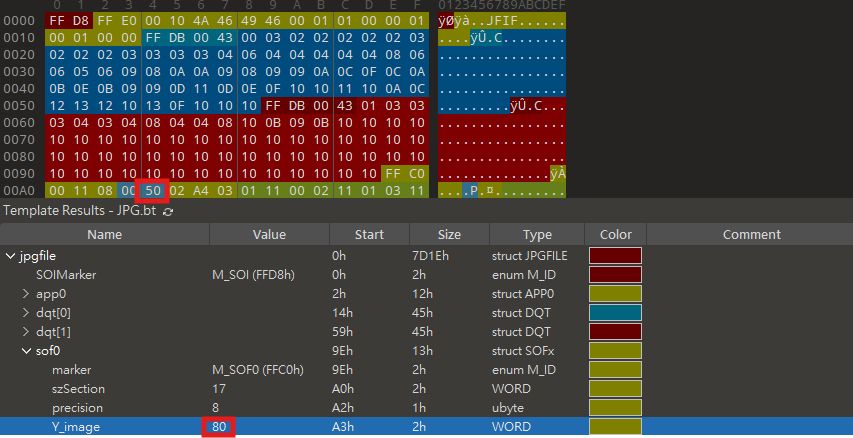  
把圖中圈選處（上）調成 BB 以上的數值或者把圈選處（下）調成 187 以上的數值即可看到 Flag  

  
Flag:`NHNC{you_can_edit_hex_00A0_04}`
